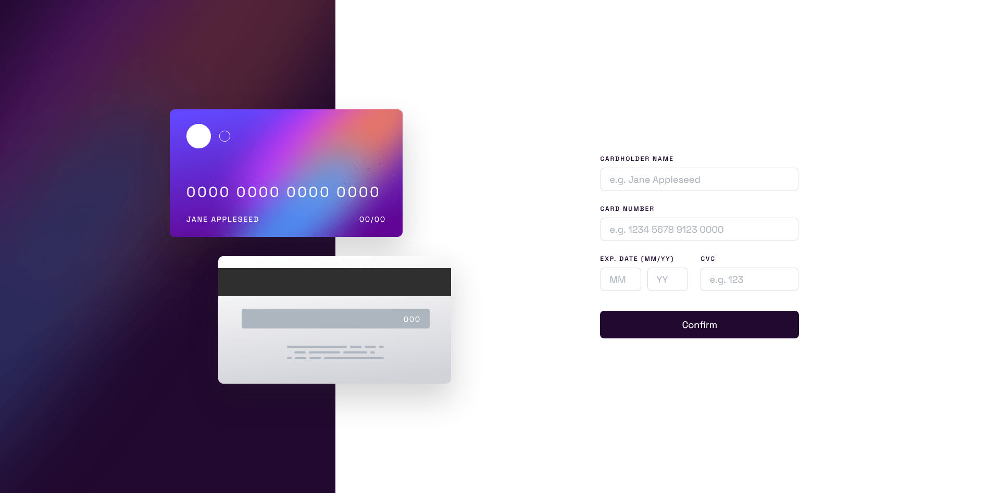
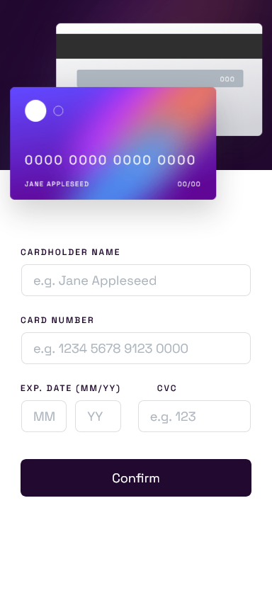

# Formulário de cartão interativo

Este projeto é um formulário de cartão de crédito, onde conforme o usuário preenche as informações nos campos, as ilustrações dos cartões vão sendo preenchidas dinamicamente na tela. O formulário também conta validação completa de todos os campos.

A interface baseada para codar esse projeto, é fornecida pelo Frontend Mentor.

# Tabela de conteúdos

* [Demonstração do projeto](#gear-Demonstração-do-projeto)
* [Tecnologias](#computer-Tecnologias)
* [Licensa](#page_facing_up-Licensa)

# :gear: Demonstração do projeto

Acesse a página aqui: https://jvuser01.github.io/formulario-de-cartao-interativo/

## Layout Desktop

## Layout Mobile

    

# :computer: Tecnologias

Este projeto foi desenvolvido utilizando as seguintes tecnologias:

* HTML5
* CSS3
* Javascript

# :page_facing_up: Licensa

Este layout é de um dos desafios do [Frontend Mentor](https://www.frontendmentor.io/).

Codado por [João Vitor](https://github.com/JVUser01) :rocket:. Esse projeto está sob a [licença MIT](LICENSE).